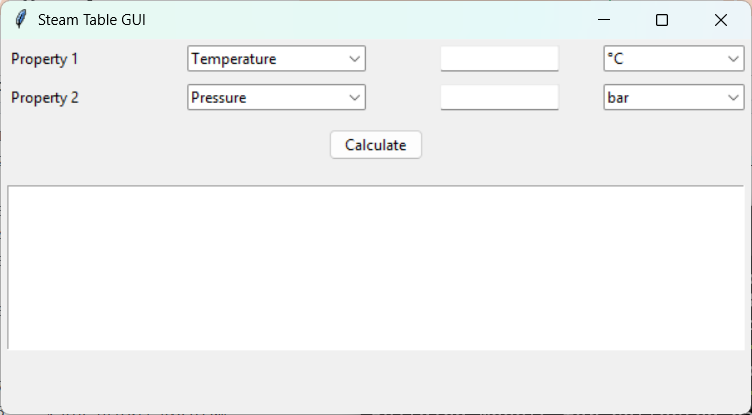
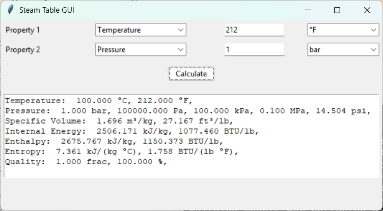

# SteamTableGUI
A Python program that calculates steam table properties using pyXSteam.  The program launches a GUI for input of steam properties.  The purpose is to provide a simple and free access to the IF-97 steam tables to assist undergraduate students with thermodynamics assignments.

## Requirements
This repository was written using *Python 3.14.6* and tested in a *Python 3.13.9* environment running on *Windows 11*.
The major dependency is ['pyXSteam'](https://pyxsteam.readthedocs.io/en/latest/).  This library (available as an install from pip ['here'](https://pypi.org/project/pyXSteam/)) is a port of a Matlab XSteam package that implements the ['IAPWC release IF-97'](http://www.iapws.org/relguide/IF97-Rev.pdf).
```
$ pip install pyXSteam
```
## Installation
This repository can be installed as a package in a Python virtual environment
```
$ python -m venv env
$ .\env\Scripts\activate # for Windows
$ source env/bin/activate # for Linux or Mac
$ pip install -e . # to install the package locally
```
## Usage
The main program is provided in `steamTables.py`.
```
$ python steamTables.py
```
This will launch a small GUI pictured below.


The user can select two different properties, enter values, select the appropriate units, and press the calculate button.  The field at the bottom of the GUI will then provide the state properties.
The available properties and units are:
- Temperature: [°C, °F]
- Pressure [bar, Pa, kPa, MPa, psi]
- Specific Volume [m³/kg, ft³/lb]
- Internal Energy [kJ/kg, BTU/lb]
- Enthalpy [kJ/kg, BTU/lb]
- Entropy [kJ/(kg °C), BTU/(lb °F)]
- Quality [frac, %]

The states may be input using any combination of the units listed above.  The output results will be presented in all of the units above.

